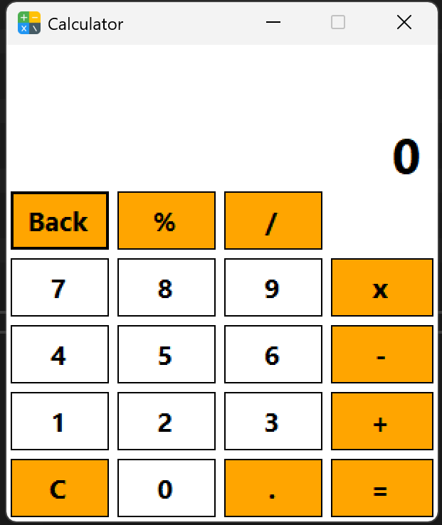

# Calculator (WinForms + OOP) - C# .NET Framework

This project is a **learning-focused calculator application** built with C# (.NET Framework) using Windows Forms and Object-Oriented Programming (OOP).

---

## 🎯 Project Purpose
To practice building desktop applications, applying OOP principles, and gaining hands-on experience with real calculator behavior.

---

## ✨ Features
- Basic operations: **+  -  ×  ÷**
- **Sequential operations** (e.g. `5 + 3 + 2 =`)
- **Change operator** before entering the second number
- **Backspace**
- **Percent** (`50 ➜ 0.5`)
- **Decimal point**
- **Clear (C)**

---

## 🧠 OOP Design
- `CalculatorEngine` handles all calculations and state
- `frmCalculator` handles the user interface and input

This separation keeps the project clean, maintainable, and easy to extend.

---

## 🖼️ Screenshot

---

## 🎥 Demo Video
*https://youtu.be/hhu4rmrjexs*

---

## 🛠️ Technologies
- C#
- Windows Forms
- .NET Framework
- Visual Studio

---

## 👤 Author
**Khalid Syntax**

- LinkedIn: https://www.linkedin.com/in/khalidamri/  
- GitHub: https://github.com/KhalidSyntax